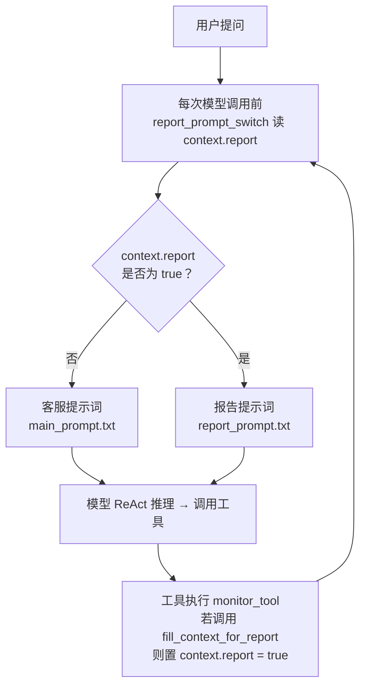
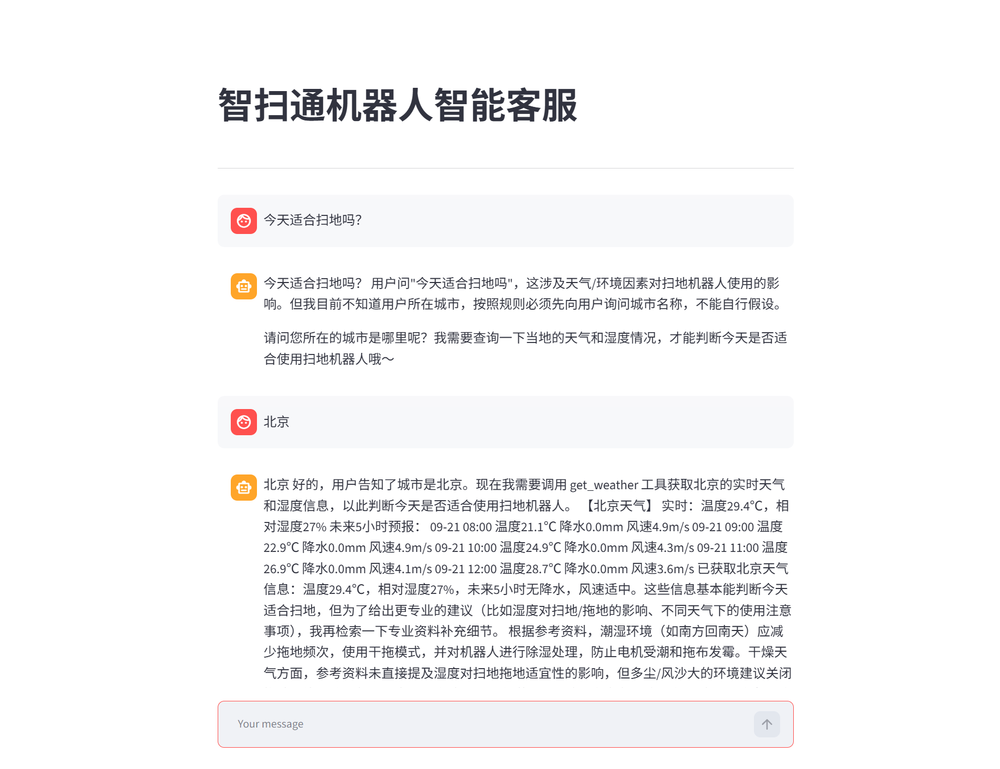
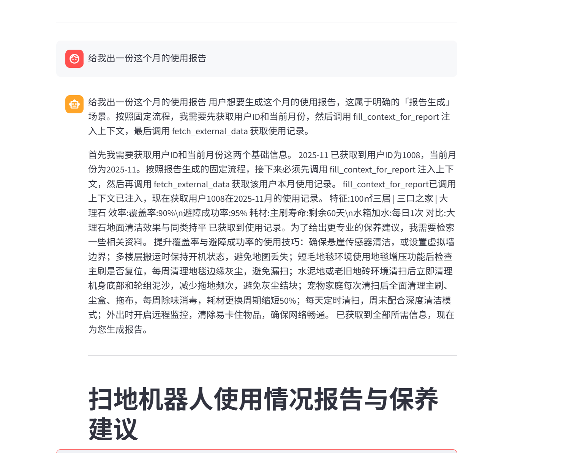
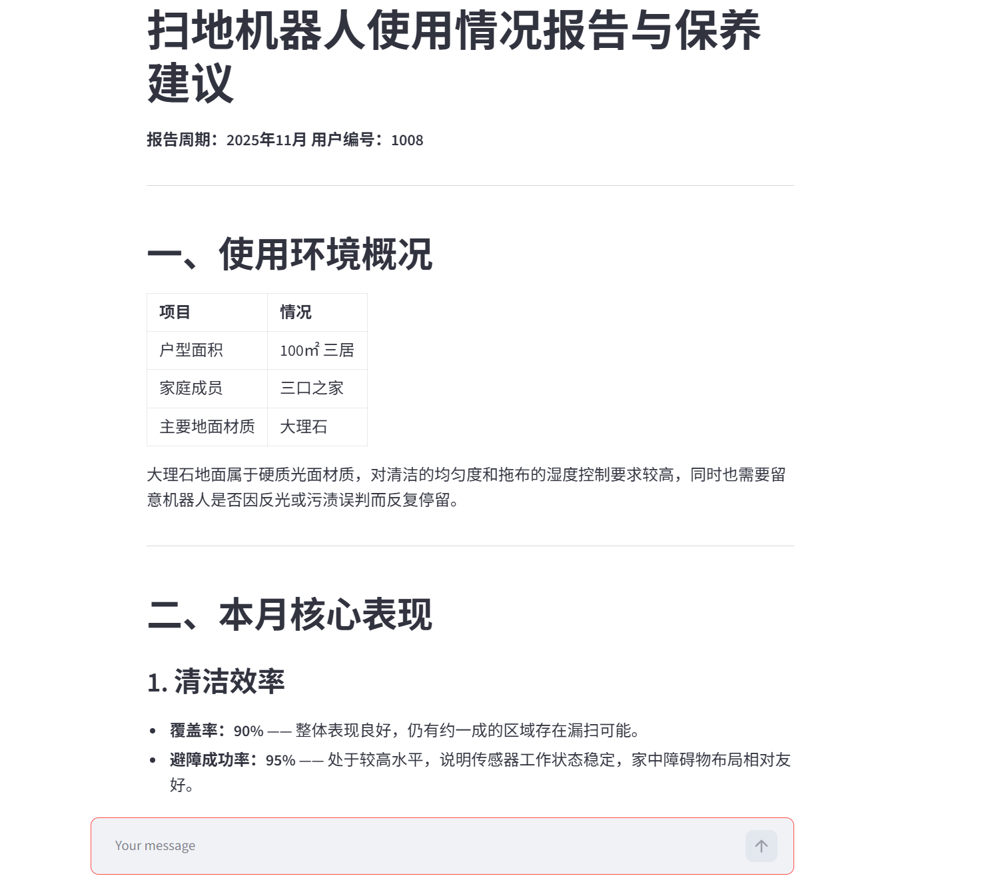
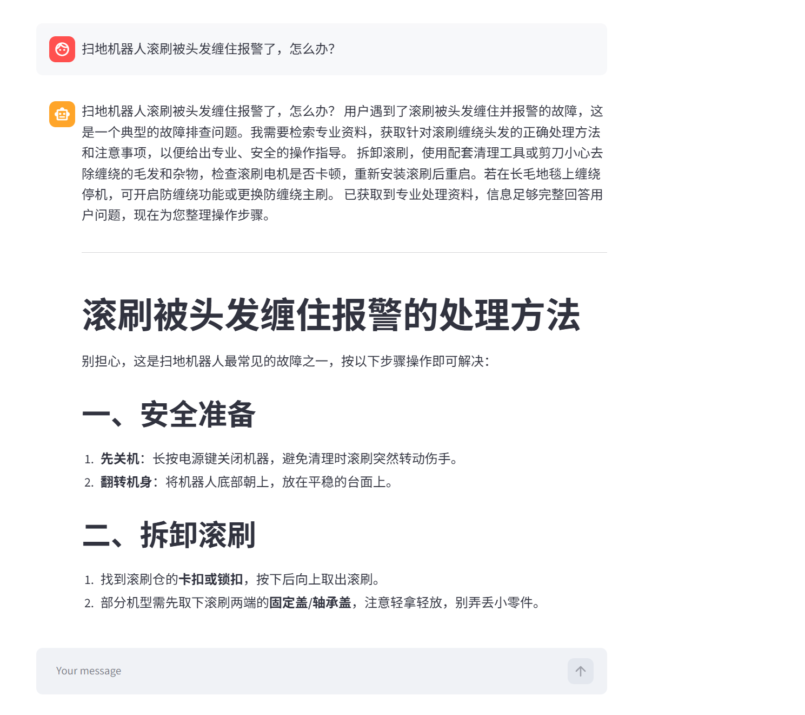
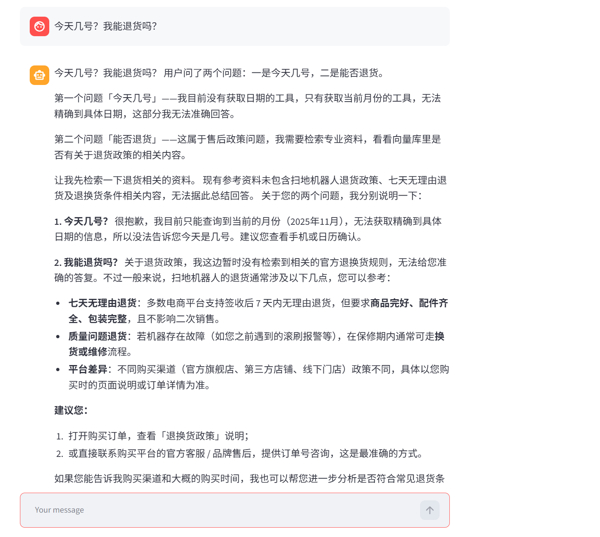

# 扫地机器人智能客服（ReAct 智能体）

基于 LangChain ReAct 架构的扫地机器人智能客服，实现「思考 → 行动 → 观察」的自主推理闭环，覆盖产品问答、故障排查、选购建议与个性化使用报告四类场景。

## 功能

- 基于 `create_agent` 构建 ReAct 智能体，集成 6 类工具（知识库检索、真实天气查询、用户 ID、当前月份、外部业务数据、报告上下文注入），支持多轮记忆与多工具协同
- 基于中间件实现工具调用监控（`wrap_tool_call`）、模型调用日志（`before_model`）与动态提示词切换（`dynamic_prompt`），在「客服问答」与「报告生成」两种模式间自动切换
- 构建 Chroma + text-embedding-v3 的 RAG 检索链路，知识库覆盖选购、故障、保养、问答等文档，支持 PDF/TXT 加载与 MD5 增量去重
- 采用抽象工厂 + YAML 配置中心管理模型与向量化参数，支持流式输出；多轮记忆靠每轮把完整对话历史重新喂给无状态的 LLM 实现；报告场景自动生成 Markdown 使用报告与保养建议
- 基于 Streamlit 的 Web 对话界面

## 目录结构

```
Agent智能体/
├── app.py                  # 入口：Streamlit 对话界面
├── requirements.txt        # 依赖清单
├── agent/
│   ├── react_agent.py      # ReAct 智能体：模型 + 6 工具 + 3 中间件
│   └── tools/
│       ├── agent_tools.py  # 6 类工具：知识检索 / 天气 / 用户ID / 月份 / 外部数据 / 报告注入
│       ├── weather_tool.py # 真实天气：Open-Meteo 地理编码 + 实时/预报
│       └── middleware.py   # 3 个中间件：工具监控 / 模型日志 / 动态提示词切换
├── rag/
│   ├── rag_service.py      # 检索 → 拼上下文 → 模型总结
│   └── vector_store.py     # Chroma 封装 + PDF/TXT 入库（MD5 去重）
├── model/
│   └── factory.py          # 抽象工厂：模型 / 向量化
├── config/                 # YAML 配置（rag / chroma / prompts / agent）
├── prompt/                 # 提示词（main / rag_summarize / report）
├── data/                   # 知识库文档 + 外部业务数据 records.csv
└── utils/                  # 配置加载 / 文件 / 日志 / 路径 / 提示词加载

运行时产物（已 gitignore）：.env、logs/、chroma_db/、md5.text
```

## 调用流程

```
用户提问
  → app.py（Streamlit 入口，传完整对话历史实现多轮记忆）
  → ReactAgent.execute_stream（agent/react_agent.py，stream_mode="values" 流式）
       ReAct 循环：思考 → 调用工具 → 观察（最多 5 次）
         ├─ 知识问答  rag_summarize → Chroma 检索(k=3) → 模型总结
         ├─ 天气查询  get_weather → Open-Meteo 真实接口（先问城市再查）
         └─ 报告生成  get_user_id → get_current_month → fill_context_for_report → fetch_external_data
       中间件（横切）：
         ├─ monitor_tool（@wrap_tool_call）→ 记录工具调用，识别报告场景
         └─ report_prompt_switch（@dynamic_prompt）→ 报告场景切换提示词
  → 流式返回前端，Streamlit 渲染
```

## 动态提示词切换（客服 ↔ 报告）

这是项目最核心的机制：同一个 Agent 里，「客服问答」和「报告生成」用不同的系统提示词，靠一个运行时状态 `context.report` 在两个中间件之间传递——`@dynamic_prompt` 负责**读**、`@wrap_tool_call` 负责**写**：



**流程说明**：

1. 每次模型调用前，`report_prompt_switch`（`@dynamic_prompt`）读 `context.report` 决定用哪套提示词，默认 `false` → 客服提示词；
2. 用户要生成报告时，客服提示词里的「报告生成强约束」引导模型依次调用 `get_user_id → get_current_month → fill_context_for_report → fetch_external_data`；
3. 当 `fill_context_for_report` 被调用，`monitor_tool`（`@wrap_tool_call`）把 `context.report` 置为 `true`；
4. 下一轮模型调用自动切到报告提示词，继续生成报告。

## 天气查询（真实 Open-Meteo 接口）

`get_weather` 工具接入 [Open-Meteo](https://open-meteo.com/) 免费天气接口，**无需 API Key**，实现见 `agent/tools/weather_tool.py`，两步走：

1. **地理编码**：`get_coordinate_by_city(city)` 把城市名转成经纬度（`geocoding-api.open-meteo.com`）；
2. **天气查询**：`fetch_weather_by_city(city)` 用经纬度查实时温度/相对湿度 + 未来 5 小时预报（温度/降水/风速），拼成字符串喂给 LLM。

返回示例：

```
【北京天气】
实时：温度30.1℃，相对湿度23%
未来5小时预报：
09-21 08:00 温度20.6℃ 降水0.0mm 风速4.7m/s
09-21 09:00 温度22.4℃ 降水0.0mm 风速5.2m/s
...
```

**「先问城市再查」的多轮流程**：`prompt/main_prompt.txt` 里的「天气/城市强约束」要求模型——当用户问题涉及天气/所在城市、但当前还不知道城市时，先反问用户确认城市，等用户回复后再调 `get_weather`，禁止自行猜测或编造城市。典型对话：

```
用户：今天适合扫地吗？
客服：请问您所在的城市是哪里呢？
用户：北京
客服：北京今天温度 30℃，湿度 23%……（调用 get_weather 后回答）
```

任何一步失败（城市查不到 / 接口异常）都返回友好提示语而非抛异常，不会中断 Agent 主流程。

## 演示截图

四类场景的真实运行效果：

### 天气查询（多轮：先问城市再查）



### 报告生成（动态提示词切换）





### 故障排查



### 边界兜底



## 技术栈

- Python
- LangChain —— ReAct 智能体、工具调用、中间件、LCEL
- Chroma —— 向量数据库；阿里云百炼 text-embedding-v3 —— 文本向量化
- DeepSeek —— 对话模型
- Open-Meteo —— 真实天气接口（地理编码 + 实时/预报）
- Streamlit —— Web 界面
- PyYAML —— 配置管理

## 快速开始

### 1. 安装依赖

```bash
pip install -r requirements.txt
```

### 2. 配置 API Key

复制 `.env.example` 为 `.env`，填入 DeepSeek 与阿里云百炼密钥：

```bash
cp .env.example .env
```

### 3. 构建知识库

将知识文档（PDF/TXT）放入 `data/` 目录，然后在项目根目录运行：

```bash
python -c "from rag.vector_store import VectorStoreService; VectorStoreService().load_documents([])"
```

向量会持久化到 `chroma_db/`（已 gitignore）。

### 4. 启动

```bash
streamlit run app.py
```

## 注意事项

- **密钥安全**：API Key 放在 `.env` 中，已加入 `.gitignore`，请勿提交到仓库。
- **首次构建**：需先执行步骤 3 构建知识库，否则问答无法检索到内容。
- 报告生成场景依赖 `config/agent.yml` 中配置的外部数据文件（`data/external/records.csv`）。
